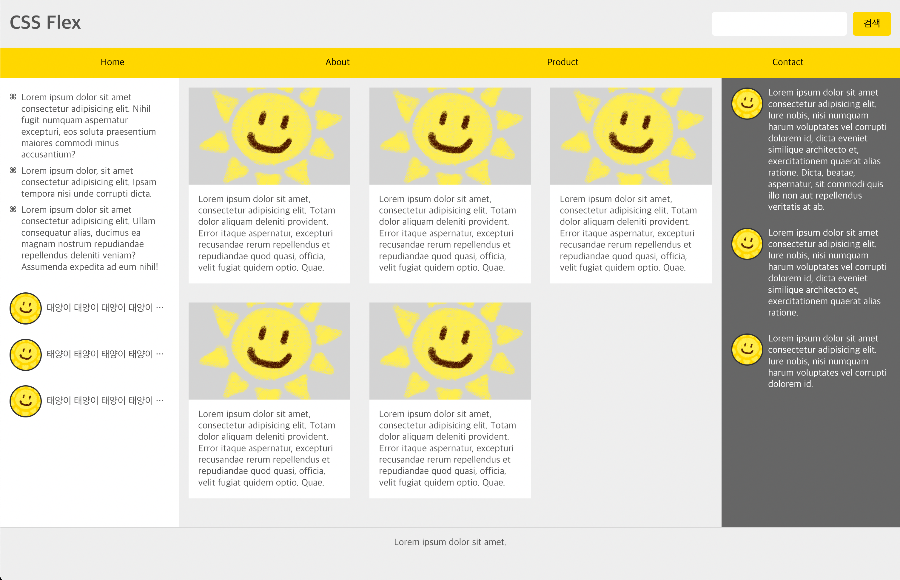

# Flex를 활용한 Layout 연습

[인프런](https://www.inflearn.com/course/css-flex-grid-%EC%A0%9C%EB%8C%80%EB%A1%9C-%EC%9D%B5%ED%9E%88%EA%B8%B0) 강의를 참고하여 Flex Layout 구성 연습

`flex-grow`, `flex-shrink`, `flex-basis`등  
기존에 어렴풋이 알고 있던 내용을 정확히 인지 후 레이아웃 구성 연습

## 내용

- `align-self`는 특정 아이템 정렬에 사용되며, `align-item`보다 우선적으로 적용된다

- `align-content`는 두 줄부터 사용하는데 의미가 있다 즉, `flex-wrap:wrap;` 상태에서 사용해야 한다.

- `flex-grow`는 해당 요소의 크기를 늘릴지에 대한 여부이며, 기본값은 0이며 늘어나지 않는다.

- `flex-shrink`는 해당 요소의 크기를 줄일지에 대한 여부이며, 기본값은 1이며 줄어든다.

- `flex-basis`는 요소의 기본 사이즈에 해당아며, 기본값은 `auto`로 `width`와 동일하다.
